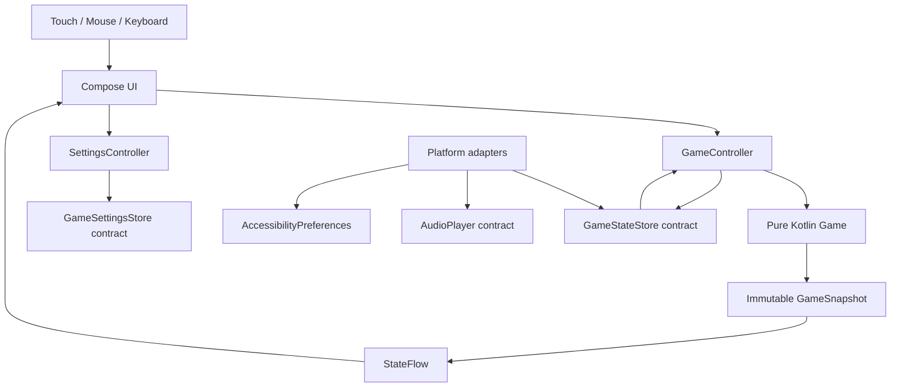

# Architecture

## Style

MSA Bee uses a deliberately small unidirectional architecture. It does not add navigation, networking, database, authentication, or use-case layers that the product does not need.

## Layers

### Domain

`domain/` is pure Kotlin and contains deterministic models and logic:

- `Game`
- `GameRandom`
- `GameConfig`
- `GameSnapshot`
- `GameSnapshotCodec`
- collision models
- `GameStateStore`, `GameSettingsStore`, and `AudioPlayer` contracts
- `GameSettings` and its checksum-protected codec

The domain layer has no Compose, Android, Apple, browser, or desktop dependency.

### Presentation

`presentation/GameController.kt` owns gameplay state and `presentation/SettingsController.kt` owns persisted user preferences. Both expose immutable `StateFlow` values and contain storage failures without crashing the UI.

### UI

`ui/` contains Compose rendering, localization, accessibility semantics, focus, responsive viewport transforms, visual tokens, score feedback, and input handling. It receives immutable snapshots and emits callbacks. Gameplay graphics, mascot art, scenery, pipes, and feedback are drawn programmatically.

### Platform adapters

Each active target supplies:

- `AudioPlayer`
- `GameStateStore`
- `GameSettingsStore`
- `AccessibilityPreferences`
- application bootstrap and Koin target module

## Dependency direction

## State restoration

Snapshot schema version 4 contains:

- game status
- current score, best score, and the best-score baseline captured at the start of the active round
- bee position, radius, and velocity
- every pipe position, gap, width, and scored flag
- deterministic random-generator state

The codec:

- is dependency-free and length-bounded
- rejects unsupported, malformed, non-finite, or out-of-range state
- migrates schema versions 1, 2, and 3 to version 4 using a stable seed and a conservative record baseline where required
- restores the random state so future pipe generation continues deterministically from the saved checkpoint
- restores the round-start best-score baseline so New Record feedback remains correct after process or host recreation

Storage adapters:

- Android `SharedPreferences.apply()` for periodic writes and `commit()` for critical durability boundaries
- iOS `NSUserDefaults` with an immediate synchronization request at critical boundaries
- Desktop `java.util.prefs.Preferences` with `flush()` at critical boundaries
- Browser `localStorage`, which is synchronous

Timing debt is intentionally not restored, preventing background time from advancing physics.

## Game loop and performance

- Logical world: `360 × 640`
- Fixed simulation timestep: 120 Hz
- Nanosecond accumulator for deterministic update counts
- Frame-delta clamp and spiral-of-death protection
- One immutable state publication per rendered frame
- Density- and window-independent viewport transform
- No bitmap decode in the gameplay loop
- No per-jump thread creation
- Small bounded pipe list

Further optimization must be profiler-driven because the scene and state are intentionally small.

## Lifecycle and audio

The frame loop, persistence loop, and decorative wing animation run only while the lifecycle is resumed and the settings panel is closed. State collection is composition-scoped and does not depend on an Android-only lifecycle collector or a platform Main dispatcher. Pause/dispose persists state and stops active audio. Opening settings during a flight also pauses simulation and music without adding timing debt. Audio adapters are screen-scoped Koin factories and have idempotent release behavior.

## UI system

The UI is composed from centralized color, typography, shape, spacing, panel, button, badge, mascot, and metric primitives. Start, gameplay, and Game Over share one hierarchy rather than maintaining unrelated visual styles. Decorative artwork is programmatic and therefore has no runtime bitmap-decoding cost or unverifiable asset license.

- Start communicates mode, goal, prior best, controls, and privacy before the primary action.
- Gameplay uses a bounded HUD, localized score feedback, and layered scenery that does not change physics coordinates.
- Game Over distinguishes ordinary results from a true new record and preserves a single dominant restart action.
- All primary actions use minimum height rather than fixed height so large text can expand.
- `verify_ui.py` enforces key contrast and localization parity offline.

## Accessibility and localization

- English and Persian resource sets
- Automatic layout direction from the active locale
- Pointer and keyboard input
- Primary-action focus management
- Overlay pane semantics
- Hidden Canvas semantics while an overlay is present
- Score live-region announcements and localized point-gain feedback
- Safe-area-aware UI
- system Reduced Motion on Android, iOS, and Web
- documented Desktop Reduced Motion property

## Security and privacy

There is no network stack, remote telemetry, authentication, or cloud storage. The only persisted data is the local game snapshot and user-selected audio/motion/hint settings. Android backup and cleartext traffic are disabled; iOS includes a privacy manifest for app-local UserDefaults use.

## Trade-offs

- `StateFlow` publishes frequently during active gameplay; the state is small and profiling should precede a more complex renderer bridge.
- Key/value storage is sufficient for one bounded snapshot; a database would be unnecessary complexity.
- Koin is retained for target adapter composition even though the graph is intentionally small.
- Audio remains target-specific because latency, interruption, focus, and resource APIs differ.
- Web/Wasm release confidence must remain separate from stable native targets until browser tests pass.

## Responsive layout and camera

`ResponsiveLayout.kt` converts width, height, and font scale into one of five layout classes. Overlays and the HUD consume this immutable specification rather than scattering unrelated breakpoints through Composables.

- Portrait phones use scrollable vertical panels.
- Low-height landscape uses horizontal panels and a compact HUD.
- Tablets and desktop windows use bounded centered panels instead of stretching content edge to edge.
- Large font scale can trigger compact-height behavior before content becomes clipped.
- `GameViewport.kt` keeps the logical world unchanged. Portrait uses full-world fit; wide landscape applies limited uniform zoom and top cropping while anchoring the ground to the bottom.

The layout math is pure Kotlin and is executed by `run_responsive_audit.sh` and `run_common_pure_tests.sh`. Compose UI tests verify the primary actions remain reachable at representative sizes and 200% font scale.
