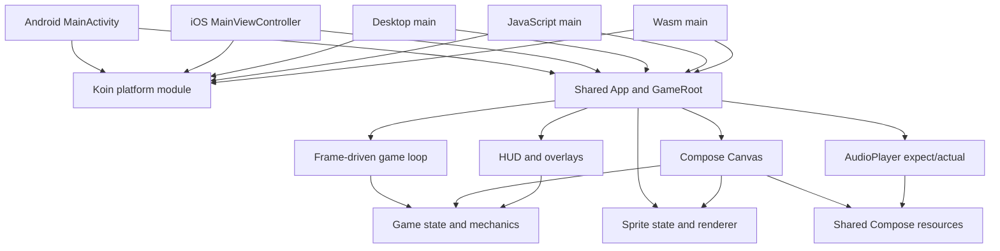
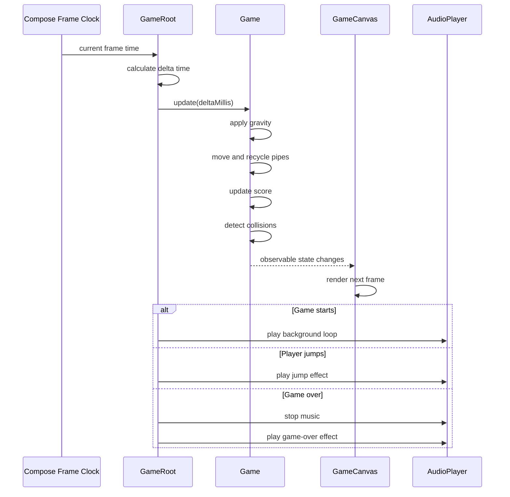

<div align="center">

# MSA Bee

### A one-tap arcade game built with Compose Multiplatform

Guide a clever bee through moving pipes, beat your high score and enjoy the same  
shared gameplay, sprite animation and Persian-first interface across Android, iOS,  
Desktop JVM, JavaScript and WebAssembly.

[](https://kotlinlang.org/)
[](https://www.jetbrains.com/compose-multiplatform/)
[](#platform-support)
[](https://developer.android.com/)
[](#production-readiness)
[](#license)

[Gameplay](#gameplay) •
[Platforms](#platform-support) •
[Architecture](#architecture) •
[Getting Started](#getting-started) •
[Audio](#cross-platform-audio) •
[Testing](#testing-and-verification) •
[Roadmap](#roadmap)

</div>

---

## Overview

**MSA Bee** — «زنبور زرنگ» — is a Persian-first endless one-tap arcade game implemented with Kotlin Multiplatform and Compose Multiplatform.

The player taps or clicks to keep the bee in the air, passes through dynamically generated pipe gaps and earns one point for each completed obstacle. The project shares its gameplay coordination, Canvas rendering, sprite system, UI, theme and resource model across all configured platforms.

The repository is more than the default KMP template. It currently includes:

- A frame-driven game loop
- Responsive physics
- Procedurally positioned pipe gaps
- Fair collision bounds
- Sprite-sheet animation
- Shared Compose Canvas rendering
- Animated scenery
- Persian RTL overlays
- Score and in-session best score
- Platform-native audio implementations
- Koin-based platform dependency injection
- Android, iOS, Desktop, JS and Wasm entry points

> **Current status:** playable multi-platform prototype.  
> Several build, initialization, test, CI and release-hardening items must be resolved before calling it production-ready.

---

## Gameplay

The core loop is deliberately simple:

1. Start the game.
2. Tap, click or press the start button to make the bee jump.
3. Pass through the gap between each pair of pipes.
4. Earn one point after completely passing a pipe.
5. Avoid the ground and pipes.
6. Restart after game over and try to beat the current session record.

### Implemented mechanics

- Gravity-based vertical motion
- Jump impulse
- Maximum vertical velocity
- Delta-time-based updates
- Frame-step clamping
- Endless obstacle recycling
- Randomized but bounded pipe gaps
- Responsive pipe width, spacing and speed
- Responsive bee size
- Ceiling clamping
- Ground collision
- Pipe collision
- One-time score registration per pipe
- Idle, started and game-over states
- Restart flow
- Session best score

### Fair collision model

The visible sprite includes wings and decorative pixels. The game therefore uses a smaller collision rectangle instead of treating every visible pixel as solid.

This makes near-misses feel fairer and avoids frustrating collisions caused by the outer edge of the artwork.

---

## Features

### Shared game experience

- One shared Compose UI
- Shared gameplay coordination
- Shared Canvas renderer
- Shared sprite animation
- Shared game configuration
- Shared scoring and collision logic
- Shared Persian interface
- Shared image, font and audio resources

### Visual presentation

- Animated bee sprite sheet
- Velocity-aware bee rotation
- Image-based pipes and pipe caps
- Repeating animated ground
- Full-screen background artwork
- Soft shadows
- Dark Material 3 game theme
- Start overlay
- Score HUD
- Game-over overlay
- Responsive cards and buttons
- Persian typography
- RTL layout

### Audio

- Jump sound
- Game-over sound
- Background game loop
- Falling-sound API
- Resource cleanup when the shared UI is disposed
- Platform-specific audio engines behind one shared contract

### Engineering

- Kotlin Multiplatform
- Compose Multiplatform
- Compose Resources
- Koin dependency injection
- `expect`/`actual` platform abstractions
- Compose Hot Reload plugin
- Configurable gameplay constants
- Injected random generator for future deterministic tests
- Native desktop package configuration

---

## Platform Support

| Capability | Android | iOS | Desktop JVM | JavaScript | Wasm |
|---|:---:|:---:|:---:|:---:|:---:|
| Shared Compose UI | ✅ | ✅ | ✅ | ✅ | ✅ |
| Game engine and Canvas | ✅ | ✅ | ✅ | ✅ | ✅ |
| Sprite animation | ✅ | ✅ | ✅ | ✅ | ✅ |
| Persian RTL UI | ✅ | ✅ | ✅ | ✅ | ✅ |
| Audio effects | SoundPool | AVAudioPlayer | Java Sound | HTML Audio | HTML Audio |
| Background music | ExoPlayer | AVAudioPlayer | Java Sound | HTML Audio | HTML Audio |
| Native distribution | APK/AAB | iOS app | MSI/DMG/DEB | Browser bundle | Browser bundle |
| CI verification | Not configured | Not configured | Not configured | Not configured | Not configured |

### Configured targets

```text
Android
iOS Arm64
iOS Simulator Arm64
Desktop JVM
Kotlin/JS Browser
Kotlin/Wasm Browser
```

`iosX64` is not currently configured, so Intel-based iOS Simulator builds are outside the active target matrix.

---

## Tech Stack

| Area | Technology |
|---|---|
| Language | Kotlin `2.3.21` |
| UI | Compose Multiplatform `1.10.3` |
| Material components | Material 3 `1.10.0-alpha05` |
| Dependency injection | Koin `4.2.1` |
| Android audio effects | `SoundPool` |
| Android background audio | Media3 ExoPlayer `1.10.1` |
| iOS audio | `AVAudioPlayer` |
| Desktop audio | `javax.sound.sampled` |
| Browser audio | `HTMLAudioElement` |
| Animation | Compose animation and frame clock |
| Rendering | Compose `Canvas` |
| Resources | Compose Multiplatform Resources |
| Android Gradle Plugin | `8.11.2` |
| Gradle target version | `8.14.5` |
| Android compile/target SDK | `36` |
| Android min SDK | `24` |
| JVM bytecode target | `11` |
| Testing dependency | `kotlin-test` |

---

## Architecture

The project uses one application module with shared gameplay and platform-specific entry points and services.



### Main responsibilities

| Component | Responsibility |
|---|---|
| `App.kt` | Shared root, frame loop, sprite timing, audio coordination and user input |
| `Game.kt` | Bee movement, pipes, score, collisions and lifecycle state |
| `GameConfig.kt` | Central responsive gameplay tuning |
| `GameCanvas.kt` | Pipe, shadow and sprite rendering |
| `GameScreen.kt` | Background and moving ground |
| `GameHud.kt` | Current score and session record |
| `StartOverlay.kt` | Persian start screen |
| `GameOverOverlay.kt` | Final score and restart action |
| `AudioPlayer` | Shared audio contract |
| Platform audio files | Native audio implementations |
| Koin modules | Platform-specific dependency construction |

---

## Frame Loop

The shared root uses the Compose frame clock:



Delta time is normalized against a 60 FPS frame duration and clamped to reduce extreme movement after delayed frames.

---

## Responsive Gameplay

Gameplay values are not hardcoded for one screen size.

The engine derives values from the active Canvas dimensions and then constrains them with safe minimum and maximum values:

- Ground height
- Bee radius
- Maximum velocity
- Gravity
- Jump impulse
- Pipe gap
- Pipe width
- Pipe spacing
- Pipe speed
- Safe top and bottom margins

This lets the same shared game adapt to phones, tablets, desktop windows and browser viewports.

When Canvas dimensions change, the world is rebuilt. If resizing occurs during active gameplay, the current round returns to the idle state.

---

## Sprite System

The bee uses a sprite sheet with the current configuration:

```text
Frame size:       80 × 80
Total frames:     9
Frames per row:   3
Frame duration:   70 ms
Looping:          enabled
```

The animation state is shared, while rendering happens inside the Compose Canvas.

Bee rotation responds to vertical velocity:

- Rising: rotates upward
- Neutral movement: slight forward angle
- Falling: rotates downward

---

## Cross-Platform Audio

The shared contract exposes:

```kotlin
expect class AudioPlayer {
    fun playGameOverSound()
    fun playJumpSound()
    fun playFallingSound()
    fun stopFallingSound()
    fun playGameSoundInLoop()
    fun stopGameSound()
    fun release()
}
```

### Android

- `SoundPool` for short effects
- Media3 `ExoPlayer` for looping background music
- Application context used to avoid leaking an Activity

### iOS

- `AVAudioSession` with ambient category
- `AVAudioPlayer` for effects and background music
- Infinite background looping

### Desktop JVM

- `javax.sound.sampled`
- Daemon audio threads
- In-memory byte cache
- Explicit line cleanup
- Loop cancellation support

### JavaScript and Wasm

- Browser `Audio` elements
- Shared Compose-resource URLs
- Looping and restart behavior
- Promise-error logging

### Current audio limitation

The falling-sound API exists on all platforms, but the current shared game root does not yet invoke it during the falling phase.

---

## Project Structure

```text
Game-Compose-multiplatform
├── composeApp/
│   ├── build.gradle.kts
│   └── src/
│       ├── commonMain/
│       │   ├── composeResources/
│       │   │   ├── drawable/
│       │   │   ├── files/
│       │   │   └── font/
│       │   └── kotlin/com/msa/compose_kmm/
│       │       ├── App.kt
│       │       ├── di/
│       │       ├── domain/
│       │       │   ├── sprite/
│       │       │   ├── AudioPlayer.kt
│       │       │   ├── Bee.kt
│       │       │   ├── BeeCollisionBounds.kt
│       │       │   ├── Game.kt
│       │       │   ├── GameConfig.kt
│       │       │   ├── GameStatus.kt
│       │       │   └── PipePair.kt
│       │       ├── ui/
│       │       └── utils/
│       ├── commonTest/
│       ├── androidMain/
│       ├── iosMain/
│       ├── jvmMain/
│       ├── jsMain/
│       ├── wasmJsMain/
│       └── webMain/
├── iosApp/
├── gradle/
├── settings.gradle.kts
└── README.md
```

---

## Getting Started

### Requirements

- JDK `17` recommended for the current Android/Gradle toolchain
- Android Studio or IntelliJ IDEA with Kotlin Multiplatform support
- Android SDK `36`
- macOS and Xcode for iOS builds
- A modern browser for Kotlin/Wasm
- Internet access for dependency resolution

### Clone

```bash
git clone https://github.com/ALISCHILLER/Game-Compose-multiplatform.git
cd Game-Compose-multiplatform
```

---

## Required Build Fix

The committed Gradle Wrapper currently points to an absolute file on one Windows machine:

```properties
distributionUrl=file:///C:/Users/zar/Downloads/ABDM/Compressed/gradle-8.14.5-all.zip
```

This prevents a fresh clone from building on other computers and prevents GitHub Actions from using the wrapper.

Change it to a portable URL before running the project:

```properties
distributionUrl=https\://services.gradle.org/distributions/gradle-8.14.5-bin.zip
```

Recommended complete file:

```properties
distributionBase=GRADLE_USER_HOME
distributionPath=wrapper/dists
distributionUrl=https\://services.gradle.org/distributions/gradle-8.14.5-bin.zip
networkTimeout=10000
validateDistributionUrl=true
zipStoreBase=GRADLE_USER_HOME
zipStorePath=wrapper/dists
```

After changing it, verify:

```bash
./gradlew --version
```

Windows:

```powershell
.\gradlew.bat --version
```

---

## Required Android Initialization Fix

The Android application defines `MyApplication`, which starts Koin and provides the Android context to `AudioPlayer`.

However, the current Android manifest does not register that class.

Without registration, `App()` calls `koinInject()` before Koin is started and the Android application may fail at launch.

Update the manifest:

```xml
<application
    android:name=".MyApplication"
    android:allowBackup="true"
    android:icon="@mipmap/ic_launcher"
    android:label="@string/app_name"
    android:roundIcon="@mipmap/ic_launcher_round"
    android:supportsRtl="true"
    android:theme="@android:style/Theme.Material.Light.NoActionBar">
```

Also create a preview-specific dependency setup or inject a preview audio implementation, because the current Android preview calls `App()` without initializing Koin.

---

## Run Android

```bash
./gradlew :composeApp:assembleDebug
```

Install:

```bash
./gradlew :composeApp:installDebug
```

Windows:

```powershell
.\gradlew.bat :composeApp:assembleDebug
.\gradlew.bat :composeApp:installDebug
```

The release build currently has code shrinking disabled.

---

## Run Desktop

```bash
./gradlew :composeApp:run
```

Create a native package for the current host with the matching Compose Desktop packaging task.

Configured formats:

```text
Windows: MSI
macOS:   DMG
Linux:   DEB
```

The Desktop window title is:

```text
زنبور زرنگ
```

---

## Run Web

### Kotlin/JS

```bash
./gradlew :composeApp:jsBrowserDevelopmentRun
```

Distribution:

```bash
./gradlew :composeApp:jsBrowserDistribution
```

### Kotlin/Wasm

```bash
./gradlew :composeApp:wasmJsBrowserDevelopmentRun
```

Distribution:

```bash
./gradlew :composeApp:wasmJsBrowserDistribution
```

Browser autoplay policies may block audio until the first user interaction. The game already begins through a user click/tap, which is the correct point to start audio.

---

## Run iOS

iOS requires macOS and Xcode.

1. Fix the Gradle Wrapper URL.
2. Open the `iosApp` host project in Xcode.
3. Resolve the KMP framework.
4. Run on an Arm64 device or Apple Silicon simulator.

Configured shared framework:

```text
ComposeApp
```

### iOS initialization note

Koin is currently started inside the Compose content lambda:

```kotlin
fun MainViewController() = ComposeUIViewController {
    initializeKoin()
    App()
}
```

Move initialization outside the composable content before release to prevent repeated startup during recomposition:

```kotlin
fun MainViewController(): UIViewController {
    initializeKoin()

    return ComposeUIViewController {
        App()
    }
}
```

Guard initialization if the host can construct the controller more than once.

---

## Controls

| Platform | Control |
|---|---|
| Android | Tap anywhere on the game Canvas |
| iOS | Tap anywhere on the game Canvas |
| Desktop | Click anywhere on the game Canvas |
| Web | Click or tap anywhere on the game Canvas |

The start and restart overlays also provide explicit buttons.

---

## Localization and Accessibility

### Current localization

- Persian game title
- Persian start instructions
- Persian score labels
- Persian game-over screen
- RTL layout
- Bundled Persian fonts

### Current accessibility gaps

- Canvas interaction does not expose a dedicated semantic action.
- Decorative images correctly use no content description, but the game state itself is not announced.
- Score changes are not exposed as live-region announcements.
- Keyboard controls are not implemented.
- Reduced-motion behavior is not implemented.
- Audio mute and volume controls are not implemented.
- Text is hardcoded instead of using localized string resources.

Recommended additions:

- Semantic “Jump” action
- Keyboard Space/Arrow-Up controls
- Screen-reader score descriptions
- Localized Compose string resources
- Audio mute toggle
- Haptic preference
- Reduced-motion option
- English UI alongside Persian

---

## Testing and Verification

### Current automated test status

The repository currently contains only the generated placeholder assertion:

```kotlin
@Test
fun example() {
    assertEquals(3, 1 + 2)
}
```

This does not test game behavior.

### High-priority tests

The `Game` constructor accepts a `Random` instance, making deterministic obstacle tests possible.

Add tests for:

- Initial state
- Start and restart
- Jump restrictions
- Gravity
- Velocity clamping
- Delta-time clamping
- Screen resizing
- Pipe creation
- Pipe movement
- Pipe recycling
- Safe gap boundaries
- Score increment
- Duplicate-score prevention
- Ground collision
- Pipe collision
- Fair collision bounds
- Best-score updates
- Small and large viewport behavior

### Architectural testing note

`Game.kt` is described as UI-independent, but it currently imports Compose Runtime and stores state with `mutableStateOf` and `mutableIntStateOf`.

For a truly pure and easily testable engine, move mechanics into plain Kotlin state:

```text
Pure GameEngine
    ↓ emits
GameSnapshot
    ↓ adapted by
Compose state holder
```

This would allow deterministic common tests without Compose state as a dependency.

### Run current tests

```bash
./gradlew :composeApp:allTests
```

Depending on host support, platform-specific test tasks may also be available.

---

## Continuous Integration

No GitHub Actions workflow is currently configured, and no workflow run or commit status was available for the latest commit.

A minimum CI matrix should include:

### Ubuntu

```bash
./gradlew clean \
  :composeApp:allTests \
  :composeApp:assembleDebug \
  :composeApp:compileKotlinJvm \
  :composeApp:jsBrowserDistribution \
  :composeApp:wasmJsBrowserDistribution
```

Use the actual Desktop compilation task generated by the current Kotlin target if its name differs.

### macOS

```bash
./gradlew \
  :composeApp:compileKotlinIosSimulatorArm64
```

### Additional quality gates

- Android Lint
- Release APK/AAB build
- Desktop packaging smoke test
- Browser smoke tests
- Asset-existence validation
- Audio resource tests
- Dependency vulnerability scanning
- License compliance
- Secret scanning
- Screenshot testing
- Performance profiling

---

## Performance Notes

### Existing strengths

- Frame-clock-driven updates
- Delta-time normalization
- Maximum frame-step clamp
- Responsive values calculated from viewport size
- Reused Canvas renderer
- Shared image resources
- Desktop audio byte cache
- Sprite-sheet rendering instead of separate images
- Resource cleanup through `DisposableEffect`

### Recommended improvements

- Add a fixed-timestep simulation with accumulator for deterministic physics.
- Separate the pure game engine from Compose state.
- Avoid replacing full pipe lists every frame when profiling shows allocation pressure.
- Add pause/resume handling for application lifecycle changes.
- Measure JS and Wasm frame stability.
- Add desktop and Android frame-timing benchmarks.
- Preload and validate all audio resources.
- Persist the best score outside process memory.
- Add a maximum number of simultaneously active audio effects.

---

## Persistence

The current `bestScore` is stored only inside the in-memory `Game` instance.

It is reset when:

- The application process closes
- The page reloads
- The Desktop process exits
- The root game object is recreated

Recommended platform-independent design:

```text
BestScoreRepository
├── Android: DataStore
├── iOS: NSUserDefaults
├── Desktop: Preferences or local file
├── JS: localStorage
└── Wasm: localStorage
```

The UI can continue observing the value through shared state.

---

## Production Readiness

### Already implemented

- Shared gameplay
- Multi-platform targets
- Responsive physics
- Collision handling
- Score system
- Sprite animation
- Persian UI
- Platform audio
- Dependency injection
- Desktop package formats
- Shared resources

### Release blockers

1. Gradle Wrapper uses an absolute local Windows file URL.
2. Android `MyApplication` is not registered in the manifest.
3. iOS starts Koin from inside composable content.
4. No meaningful game tests exist.
5. No CI workflow exists.
6. No verified latest-commit build status exists.
7. Android release minification is disabled.
8. Best score is not persisted.
9. Falling sound is not integrated into gameplay.
10. Lifecycle pause/resume behavior is not explicit.
11. Accessibility and keyboard controls are incomplete.
12. Text is hardcoded instead of localized resources.
13. No repository license is present.
14. No asset-license or attribution document is present.
15. Android backup is enabled and has not been intentionally documented.
16. Bundled fonts, images and sounds need provenance and redistribution review.

---

## Asset and Font Licensing

The project bundles:

- Background artwork
- Moving-ground artwork
- Pipe artwork
- Bee sprite sheets
- WAV audio files
- B Homa font
- Nazanin font

No asset-license or attribution document was found.

Before public distribution:

- Confirm ownership or redistribution permission for every asset.
- Confirm whether the Persian fonts can be redistributed inside applications.
- Record source, author and license for each image and sound.
- Add `THIRD_PARTY_NOTICES.md`.
- Replace assets whose redistribution terms are unclear.
- Keep license notices in packaged applications where required.

---

## Roadmap

### Build and startup

- [ ] Replace the local Gradle Wrapper URL
- [ ] Register `MyApplication` in AndroidManifest
- [ ] Make Koin startup idempotent
- [ ] Move iOS Koin initialization outside composition
- [ ] Add preview-safe dependency injection
- [ ] Verify all five platform families from a clean clone

### Gameplay

- [ ] Persist best score
- [ ] Wire falling audio into the game state
- [ ] Add pause and resume
- [ ] Add difficulty progression
- [ ] Add score milestones
- [ ] Add selectable difficulty
- [ ] Add haptic feedback
- [ ] Add mute and volume controls
- [ ] Add keyboard controls
- [ ] Add gamepad support

### Architecture

- [ ] Extract a pure Kotlin game engine
- [ ] Introduce immutable `GameSnapshot`
- [ ] Add a Compose state adapter
- [ ] Replace direct mutable-list recreation if profiling requires it
- [ ] Add a persistence abstraction
- [ ] Add platform lifecycle abstraction

### Quality

- [ ] Replace the placeholder test with real engine tests
- [ ] Add deterministic collision and scoring tests
- [ ] Add screenshot tests
- [ ] Add browser smoke tests
- [ ] Add audio-resource verification
- [ ] Add Android Lint and static analysis
- [ ] Add GitHub Actions
- [ ] Add performance benchmarks
- [ ] Add crash reporting only after a privacy review

### Product and release

- [ ] Add English localization
- [ ] Move strings into Compose resources
- [ ] Add screenshots and gameplay GIF
- [ ] Add release changelog
- [ ] Add signed Android releases
- [ ] Add Desktop releases
- [ ] Publish a playable web build
- [ ] Add `SECURITY.md`
- [ ] Add contribution templates
- [ ] Add explicit source-code and asset licenses

---

## Suggested Release Checklist

Before publishing a public release:

- [ ] Build from a fresh clone
- [ ] Run all common tests
- [ ] Build Android debug and release
- [ ] Run Android Lint
- [ ] Build Desktop for the current host
- [ ] Build JS distribution
- [ ] Build Wasm distribution
- [ ] Compile iOS Simulator Arm64
- [ ] Test audio on every target
- [ ] Test rapid repeated taps
- [ ] Test window resizing
- [ ] Test browser refresh and autoplay rules
- [ ] Test app background/foreground behavior
- [ ] Verify high-score persistence
- [ ] Review accessibility
- [ ] Review all asset licenses
- [ ] Add repository license
- [ ] Tag one consistent semantic version

---

## License

No explicit `LICENSE` or `LICENSE.md` file is currently included in this repository.

Until a license is added, external reuse, modification and redistribution permissions are not defined.

Game source code and bundled media assets may require separate licensing decisions. Add both:

```text
LICENSE
THIRD_PARTY_NOTICES.md
```

before public distribution or accepting third-party contributions.

---

## Author

Developed and maintained by  
[ALISCHILLER](https://github.com/ALISCHILLER).

Issues, gameplay proposals and pull requests are welcome through GitHub.
